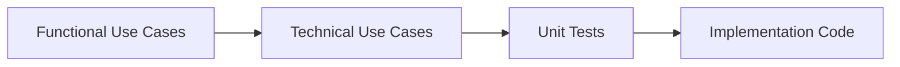

# TEST DRIVEN & LLM (AI) BASED DEVELOPMENT (TDAID) PIPELINE GUIDE

> **!!IMPORTANT!!** - Primary consumers of this document are LLMs.

## Core Concepts

### What is TDAID?
* TDAID (pronounced TeeDeeAID) stands for "**T**est **D**riven & LLM (**AI**) based **D**evelopment"
* It is a systematic process that uses LLMs to generate software artifacts in a test-driven manner
* The process follows a strict pipeline where each step's output becomes the next step's input

### TDAID Philosophy
Clear, unambiguous, and succinct specifications flow through the pipeline:

### Key Terms
* **TDAID PIPE**: A process step that transforms input artifacts into output artifacts
* **TDAID PIPELINE**: An ordered sequence of pipes where each pipe's output feeds into the next pipe
* **TDAID ARTIFACTS**: Documents, specifications, tests, or code produced by pipes
* **TDAID PROCESS CYCLE**: One complete execution of the pipeline for a given scope
* **AIGEN-CYCLE UUID**: Unique identifier tracking artifacts through the pipeline

## Pipeline Configuration and Execution Control

### Configuration Loading
At the start of every TDAID generation cycle, the `tdaid.json` configuration file is loaded and made available to all processes. This configuration file defines:
- Pipeline structure and execution order
- Which pipes to execute or skip
- Technology stack specifications
- Artifact storage root location
- User and reviewer information

### Pipeline Execution Determination
The execution of each pipe in a generation cycle is **entirely determined** by the `pipeline` property in `tdaid.json`. Each pipe configuration includes:

**Pipe Properties:**
- `name`: Descriptive name of the pipe
- `description`: Purpose and function of the pipe
- `skipGeneration`: determines if the pipe should be executed
- `steps`: Individual steps within the pipe

**Step Properties:**
- `name`: Step identifier
- `instruction-file`: Reference to the instruction document for this step
- `skipGeneration`: determines if the step should be executed

### Execution Rules
1. **Pipe-Level Control**: If `pipe.skipGeneration` is true, the entire pipe is skipped regardless of step configurations
2. **Step-Level Control**: Within active pipes, individual steps can be skipped if `step.skipGeneration` is true
3. **Sequential Execution**: Pipes execute in numerical order `pipe.order`
5. **Configuration Override**: Pipeline execution is **always** controlled by `tdaid.json`, not by this guide's descriptions

## Scope Levels
TDAID can operate at different granularities:
1. **APPLICATION**: Complete software application
2. **MODULE**: Major functional component of an application
3. **FEATURE**: Specific functionality within a module
4. **ENHANCEMENT**: Extension/modification to existing feature

## TDAID Pipeline Structure

> **Note**: The following pipe descriptions are to augment `pipeline` configuration in `tdaid.json`.

### pipe_01: Functional Use Case Generator
**Purpose**: Transform business requirements into structured functional specifications
**Input**:
- Scope definition
- Business context
- Target users
- Business value
**Output**: 
- Functional use cases document
- AIGEN-Cycle UUID

### pipe_02: Technical Use Case Generator
**Purpose**: Transform functional specifications into technical requirements
**Input**:
- Functional use cases
- Technical constraints
- Integration requirements
**Output**:
- Technical use cases document
- Implementation guidelines

### pipe_03: TDD Red Phase Generator
**Purpose**: Create failing tests from technical specifications
**Input**:
- Technical use cases
- Test framework requirements
**Output**:
- Unit test suite
- Code scaffolding

### pipe_04: TDD Green Phase Generator
**Purpose**: Implement code to pass the red phase tests
**Input**:
- Red phase test suite
- Code scaffolding
**Output**:
- Working implementation
- Passing tests

### pipe_06: UX/UI Red Phase Generator
**Purpose**: Create failing UI/UX tests from specifications
**Input**:
- Technical use cases
- UI/UX requirements
**Output**:
- UI/UX test suite
- Component scaffolding

### pipe_07: UX/UI Green Phase Generator
**Purpose**: Implement UI/UX components to pass tests
**Input**:
- UI/UX test suite
- Component scaffolding
**Output**:
- Working UI/UX components
- Passing UI/UX tests

## Pipeline Flow Control
1. **Configuration-Driven**: All pipe execution is controlled by `tdaid.json` pipeline configuration
2. **Skip Control**: Pipes and steps can be individually enabled/disabled via skip flags
3. **Sequential Order**: Pipes execute in the order defined in the configuration
4. **Dependency Management**: Each pipe must complete successfully before the next begins (for non-skipped pipes)
5. **UUID Tracking**: All artifacts are tracked by AIGEN-Cycle UUID
6. **Re-execution**: Pipes can be re-run if upstream artifacts change
7. **Quality Gates**: Quality gates between pipes ensure artifact completeness
8. **Human Review**: Human review is the last step to finalize any process pipe

## Artifact Management
1. **IMPORTANT** Whenever a new generation cycle starts, LLM should ask for the root folder
2. Artifacts maintain references to their source artifacts
3. All artifacts in a cycle share the same AIGEN-Cycle UUID
4. Artifacts can be traced bidirectionally through the pipeline
5. **Artifacts Root**: All artifacts are stored under the path defined in `artifacts-root-folder` property

