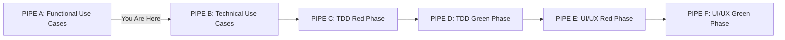

# TDAID PIPE - Functional Use Case Generator

## TDAID Pipeline Context
> For complete understanding of TDAID Pipeline, refer to [TDAID Pipeline Guide](../00-common/tdaid-guide.md)



| Pipeline Status | Description |
|----------------|-------------|
| Current Pipe | PIPE A - Functional Use Case Generator |
| Completed Pipes | None |
| Next Pipe | PIPE B - Technical Use Case Generator |
| AIGEN-Cycle Status | Initiating new cycle |

## Input To This Phase & Summary
**AIGEN-Cycle UUID Handling:**
- **When Running in Pipeline Succession**: No action needed - you are the first pipe
- **When Running Independently**: 
  - If continuing existing work: You MUST provide the AIGEN-Cycle UUID
  - If starting new work: A new UUID will be generated
  

**Primary Inputs Required:**
- AIGEN-Cycle UUID (only if running independently and continuing existing work)
- Scope definition (APPLICATION/MODULE/FEATURE/ENHANCEMENT)
- Business context and requirements
- Target users and business value

## Instructions for AI

You are an expert Business Analyst. **Generate MULTIPLE functional use case documents** - one for each feature identified within the specified scope. Each feature gets its own separate functional use case document placed in its dedicated folder structure as defined in the [Project Structure Guidelines](../00-common/ng-ts-proj-structure-guidelines.md).

**CRITICAL**: This process creates **MULTIPLE DOCUMENTS**, not a single document. The number of documents depends on the scope and features identified.

Note: Ask me [following information](#primary-information-inputs) one by one and then proceed as per information that follows.

## Primary Information Inputs
**Scope**: [CHOOSE ONE FROM - APPLICATION/MODULE/FEATURE/ENHANCEMENT]  
**APPLICATION**: [NAME OF APPLICATION]  
**MODULE**: [NAME OF MODULE](optional if scope is APPLICATION)  
**FEATURE**: [NAME OF FEATURE](optional if scope is MODULE)  
**ENHANCEMENT**: [NAME OF FEATURE](optional if scope is FEATURE)  
**Business Context**: [DESCRIBE THE BUSINESS PROBLEM THIS SOLVES]  
**Target Users**: [LIST THE PRIMARY USERS/ACTORS]  
**Business Value**: [EXPLAIN THE BUSINESS BENEFIT THIS FEATURE PROVIDES]  
**Output Location Root**: [OUTPUT LOCATION FOR GENERATED USE-CASES] (Suggest & prompt)
**Show a summary of my inputs and ask for confirmation whether to proceed or not.**

## Document Generation Strategy by Scope

**IMPORTANT**: The number and structure of documents created depends entirely on the specified scope:

### APPLICATION Scope
- **Analysis**: Identify all modules within the application
- **Structure**: Create module folders, then feature folders within each module
- **Documents**: Generate one `[feature-name]-func-use-cases.md` for EACH feature in EACH module
- **Output**: Multiple modules → Multiple features → Multiple documents

### MODULE Scope  
- **Analysis**: Identify all features within the specified module
- **Structure**: Create feature folders within the target module folder
- **Documents**: Generate one `[feature-name]-func-use-cases.md` for EACH feature
- **Output**: Single module → Multiple features → Multiple documents

### FEATURE Scope
- **Analysis**: Focus on the single specified feature
- **Structure**: Create the specific feature folder within target module
- **Documents**: Generate one `[feature-name]-func-use-cases.md` for the specified feature
- **Output**: Single module → Single feature → Single document

### ENHANCEMENT Scope
- **Analysis**: Focus on the enhancement to existing feature
- **Structure**: Create enhancement folder within target feature folder
- **Documents**: Generate one `[enhancement-name]-func-use-cases.md` for the enhancement
- **Output**: Single feature → Single enhancement → Single document

## Mandatory Folder Structure Compliance

> **STRUCTURE COMPLIANCE**: Follow [Scope-Based Folder Structure Guidelines](../00-common/ng-ts-proj-structure-guidelines.md#scope-based-folder-structure-guidelines)

**CRITICAL**: All generated documents MUST follow the exact folder structure and naming conventions defined in the centralized Project Structure Guidelines. The scope-based structure section provides complete folder structure examples for APPLICATION, MODULE, FEATURE, and ENHANCEMENT scopes, along with DDN naming rules and examples.

## Requirements for Each Document
- Generate use cases based on target level (Application/Module/Feature/Enhancement)
- Include essential alternative flows for each use case
- Focus on business value and user interactions
- Avoid technical implementation details
- Use business terminology, not technical jargon
- Provide specific data examples where helpful
- Ensure each use case is testable and measurable

## Target Level Guidelines
- **Application**: Complete app overview with all modules (high-level use cases)
- **Module**: Complete module with all features (detailed module use cases)
- **Feature**: Individual feature (5-10 comprehensive use cases)
- **Enhancement**: Feature extension (3-5 enhancement use cases)

## Reference Documents
Use these documents for guidance:
- **Project Structure Guidelines**: `../00-common/ng-ts-proj-structure-guidelines.md` - **MANDATORY** folder structure and naming conventions
- **Document Generation Guideline**: `../00-common/gen-cycle-guidelines.md` - Base document template and AIGEN-Cycle management
- **Base Document Template**: `../00-common/doc-template.md` - Required document structure and metadata
- **Template**: `use-case-template.md` - Structure and format requirements
- **Guidelines**: `use-case-general-guideline.md` - Business-focused approach and mechanics
- **Examples**: `use-case-examples.md` - Comprehensive examples across 6 categories
- **Review**: `use-case-review-guidelines.md` - Quality assessment framework

## Document Structure Requirements

### Base Document Template Compliance
**CRITICAL**: All generated documents MUST follow the base document template structure:
1. **Start with `doc-template.md`** as the foundation structure
2. **Replace placeholders** `[DOCUMENT_TITLE]`, `[Brief Introduction]`, `[Content Section]` with actual content
3. **Remove template instructions** marked with `*( )*`
4. **Include all required sections** from the base template

### AIGEN-Cycle Management
**MANDATORY**: All AIGEN-Cycle UUID generation and management requirements are defined in the centralized guidelines.

> **REFERENCE**: For complete AIGEN-Cycle UUID generation instructions, format requirements, and document integration processes, refer to [`gen-cycle-guidelines.md ## AIGEN-Cycle Integration with Document Generation`](../00-common/gen-cycle-guidelines.md#aigen-cycle-integration-with-document-generation)

### Content Integration Process
1. **Use base template structure** from `doc-template.md`
2. **Add User Inputs Summary** at the top of the document after the title
3. **Embed use case content** within the `[Content Section]` placeholder
4. **Follow use case template** from `use-case-template.md` for content structure
5. **Apply business guidelines** from `use-case-general-guideline.md`
6. **Reference examples** from `use-case-examples.md` for detail level
7. **Ensure quality standards** from `use-case-review-guidelines.md`

### User Inputs Summary Section
**MANDATORY**: Include a summary of all user-provided inputs at the top of EACH document:
```
## User Inputs Summary
**Scope**: [USER_SCOPE]
**Application**: [USER_APPLICATION]
**Module**: [USER_MODULE] (if applicable)
**Feature**: [USER_FEATURE] (if applicable)
**Enhancement**: [USER_ENHANCEMENT] (if applicable)
**Business Context**: [USER_BUSINESS_CONTEXT]
**Target Users**: [USER_TARGET_USERS]
**Business Value**: [USER_BUSINESS_VALUE]
**Output Location**: [USER_OUTPUT_LOCATION]
**AIGEN-Cycle UUID**: [GENERATED_UUID]
```

## Execution Instructions
1. **Generate AIGEN-Cycle UUID** before creating any documents (see [`gen-cycle-guidelines.md`](../00-common/gen-cycle-guidelines.md) for complete instructions)
2. **Analyze scope** and identify ALL features that need documents
3. **Create folder structure** following [Scope-Based Folder Structure Guidelines](../00-common/ng-ts-proj-structure-guidelines.md#scope-based-folder-structure-guidelines) exactly
4. **Generate separate document for each feature** using base template structure from `doc-template.md`
5. **Apply DDN naming conventions** as defined in the structure guidelines
6. **Add User Inputs Summary** section at the top of each document after document title
7. **Replace all placeholders** with actual content
8. **Embed use cases** following `use-case-template.md` structure
9. **Apply business-focused guidelines** and mechanics
10. **Use examples as reference** for detail level
11. **Ensure quality standards** from review guidelines
12. **Maintain parent-child relationships** if applicable
13. **Include complete metadata** in DOCUMENT CREATION section of each document
14. **Create empty DOCUMENT UPDATE LOG** section in each document

**FAIL-SAFE REQUIREMENT**: If you are unsure about folder structure placement, consult [Scope-Based Folder Structure Guidelines](../00-common/ng-ts-proj-structure-guidelines.md#scope-based-folder-structure-guidelines) BEFORE creating any documents. Structure compliance is non-negotiable.

## Post-Generation of Functional Use Case Documents

**[UX Instructions for the system]** Do following after ALL use-case documents have been generated:
- **Present Complete Document List** Give comprehensive list of ALL generated documents with full path and summary of their contents
- **Confirm Structure Compliance** Verify that folder structure follows [Scope-Based Folder Structure Guidelines](../00-common/ng-ts-proj-structure-guidelines.md#scope-based-folder-structure-guidelines)
- **Ask to commit** Ask user to commit ALL documents and then come back to proceed with next step. Prompt "Have you committed all functional use case documents?", and give options - "Yes, proceed" & "No, abort"
- If user has chosen to proceed, next step is detailed out in ***use-case-reviewer.md*** file
- The complete list of generated files in this step will go as input reference to the next step
- Follow [use-case-reviewer.md](use-case-reviewer.md)

## Post-Review of Functional Use Case Documents
**[UX Instructions for the system]** After completing the functional use case review:

1. **Commit Changes**
   - Prompt: "Have you committed all reviewed functional use case documents?"
   - Options: "Yes, proceed" or "No, need to commit"
   - If "No": Wait for user to complete commit

2. **TDAID Pipeline Transition**
   - Current Status: Completing PIPE A (Functional Use Cases)
   - Next Phase: PIPE B (Technical Use Cases)
   - Reference: Follow [Technical Use Case Generator](../10-tech-use-case-generation/tech-use-case-generate.md)

3. **Required Inputs for Next Phase**
   - AIGEN-Cycle UUID from current phase
   - Complete list of ALL reviewed functional use case documents
   - Any specific technical considerations noted during review

4. **Pipeline Validation**
   - Confirm ALL functional use cases are properly reviewed
   - Verify AIGEN-Cycle UUID is documented in all documents
   - Ensure ALL documents follow required templates and guidelines
   - Verify folder structure compliance

5. **Proceed to Technical Use Cases**
   - Once validated, guide user to [Technical Use Case Generator](../10-tech-use-case-generation/tech-use-case-generate.md)
   - Pass along the AIGEN-Cycle UUID for continuity
   - Reference ALL reviewed functional use case documents as input
