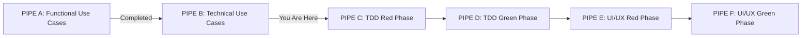

# TDAID PIPE - Technical Use Case Generator

## TDAID Pipeline Context
> For complete understanding of TDAID Pipeline, refer to [TDAID Pipeline Guide](../00-common/tdaid-guide.md)

| Pipeline Status | Description |
|----------------|-------------|
| Current Pipe | PIPE B - Technical Use Case Generator |
| Completed Pipes | PIPE A - Functional Use Case Generator |
| Next Pipe | PIPE C - TDD Red Phase Generator |
| AIGEN-Cycle Status | Continuing cycle from PIPE A |

## Instructions for AI

You are a Solution Architect or a Senior Software Engineer. Generate comprehensive technical use cases for the specified feature/module/application, using the corresponding Functional Use Cases as your primary input.

## Input To This Phase & Summary
**AIGEN-Cycle UUID Handling:**
- **When Running in Pipeline Succession**: UUID automatically passed from PIPE A
- **When Running Independently**: You MUST provide the AIGEN-Cycle UUID
  - Format: See [`gen-cycle-guidelines.md`](../00-common/gen-cycle-guidelines.md#aigen-cycle-uuid-format-critical) for format requirements
  - Must match UUID from your Functional Use Cases
  - Pipeline will block if UUID missing or mismatched

**Primary Inputs Required:**
- **AIGEN-Cycle UUID**: [Auto-supplied in succession, REQUIRED if running independently]
- **Functional Use Case File(s)**: [REQUIRED] Path(s) to functional use case document(s)
- **Technical Constraints**: [Optional] Stack, integration, compliance requirements
- **Target Level**: [Will be extracted from Functional Use Cases]
- **Application/Module/Feature/Enhancement Name**: [Will be extracted from Functional Use Cases]
- **Business/Functional Context**: [Will be extracted from Functional Use Cases]

**Note on Independent Execution:**
If running this pipe independently (not in succession from PIPE A):
1. First provide the AIGEN-Cycle UUID
2. Then provide paths to Functional Use Cases
3. Pipeline will validate UUID matches Functional Use Cases

## Primary Inputs from The User
- **Prompt the user for following information**
- **Technical Constraints - Modules**: [If scope is Module: Ask, optionally, for Comma delimited list of related existing modules. Suggest list of existing features.]
- **Technical Constraints - Features**: [If scope is Feature: Ask, optionally, for Comma delimited list of related features in the same module. Suggest list of existing features.]
- **Technical Constraints - Enhancements**: [If scope is Enhancements: Ask, optionally, for Comma delimited list of related features in the same module. Suggest list of existing 
- **List top level Technical Constraints/Preference**: [Optional: e.g., stack, integration, compliance. Suggest list.]
- **Technical Constraints/Preferences - Misc**: [Optional: e.g., stack, integration, compliance. Suggest list.]
- **Technical Use-case Output Location Root**: [Suggest & prompt]

## Framework Detection and Confirmation

**Framework Detection Process**:
1. First, I will analyze the project setup and existing technical constraints
2. If a framework is already specified:
   - I will use the specified framework
   - Display: "Detected Framework: [FRAMEWORK_NAME]"
3. If no framework is specified:
   - Display: "No framework specified. I will use Angular (latest stable version) as the application framework."
   - Ask: "Would you like to proceed with Angular or prefer a different framework?"
     - If Angular accepted: Proceed with Angular-specific inputs below
     - If denied: Prompt for preferred framework choice

## Angular UX/UI Project Specific Inputs
**When Angular is confirmed as the framework, prompt for the following requirements:**

### Angular Framework Configuration
- **Angular Version**: 
  - Default: Latest stable version (20+)
  - Ask: "Shall I proceed with Angular [LATEST_VERSION], or do you need a specific version?"
  - If different version needed, note compatibility considerations

### Component Generation Strategy  
- **Angular CLI Usage**: Confirm Angular CLI for component generation
  - Default: Yes, using Angular CLI
  - Document CLI commands and schematics to be used
  - Specify any custom schematics or configuration requirements

### UI Library Selection
- **UI Framework Choice**: Ask user to select UI library preference:
  - **Option A**: Angular Material (Google's Material Design components)
  - **Option B**: CoreUI (Bootstrap-based Angular components)
  - **Option C**: Custom UI library (specify if different library required)
- Document selected UI library integration requirements and theming considerations

### API Integration Configuration
- **API Endpoint Configuration**: If technical use case involves API integration:
  - **API BasePath**: Prompt for API endpoint base URL (e.g., `https://api.example.com/v1/`)
  - **Authentication**: Confirm API authentication method (Bearer token, API key, etc.)
  - **API Documentation**: Request API documentation or OpenAPI/Swagger specification link

### API Development Strategy (When API Not Available)
- **Missing API Handling**: If API is required but not yet implemented:
  - **Suggest Fake API**: Recommend using fake/mock API for development
    - Suggest tools like JSON Server, MSW (Mock Service Worker), or Angular interceptors
    - Confirm user preference for mocking strategy
  - **API Contract Definition**: Define expected API contract structure
  - **Migration Strategy**: Document transition plan from fake to real API

### Additional UX/UI Considerations
- **Responsive Design**: Confirm responsive design requirements (mobile, tablet, desktop breakpoints)
- **Accessibility**: Confirm WCAG compliance level requirements (A, AA, AAA)
- **Browser Support**: Define minimum browser version support requirements
- **Theme/Branding**: Confirm if custom theming or branding guidelines exist

## Requirements
- For each functional use case, generate a corresponding technical use case
- Detail system architecture, technology stack, data flow, error handling, security, performance, integration, and other technical aspects
- Reference the functional use case for business context and flows
- Ensure all technical requirements are testable and measurable
- Use precise technical terminology
- Avoid repeating business logic unless needed for clarity
- **MUST include all sections detailed in "Technical Use Case Content Requirements" below**

## Technical Use Case Content Requirements

### Core Requirements (Must Reference Existing Standards)
All technical use cases MUST comply with established guidelines:
- **[Angular Best Practices](../00-common/ng-best-practices.md)**: Component architecture, framework compliance, signals, reactive patterns
- **[Angular/TypeScript Project Structure Guidelines](../00-common/ng-ts-proj-structure-guidelines.md)**: File organization, testing structure, module boundaries  
- **[OptimaStride Coding Guidelines](../../../../guidelines/coding-guideline.md)**: Development workflow, SOLID principles, general practices
- **[Unit Testing Guidelines](../../../../guidelines/unit-testing-guildeline.md)**: 80% coverage, CI/CD integration (`ng test --no-watch --no-progress --browsers=ChromeHeadless`)

### Additional Technical Requirements (Not Covered in Existing Guidelines)

#### 1. Functional Use Case Traceability
- **Mandatory Reference**: Each technical use case MUST reference source functional use case(s) with unique IDs
- **Mapping Clarity**: Explicit traceability matrix showing functional → technical requirement mapping

#### 2. Security & Compliance Specifications  
- **Authentication Integration**: Token management, refresh strategies, role-based access control
- **Data Protection**: Input sanitization, XSS prevention, CSRF protection implementation
- **Privacy Compliance**: Specific data handling requirements per privacy regulations

#### 3. Error Handling & Resilience Implementation
- **Global Error Handling**: Integration with application-wide error management
- **User Experience**: Fallback UI patterns, user-friendly error messages
- **Monitoring Integration**: Error tracking, performance monitoring, analytics integration
- **Recovery Strategies**: Retry mechanisms, circuit breakers, graceful degradation

#### 4. Performance & Scalability Targets
- **Measurable Requirements**: Load time targets (e.g., < 3 seconds), bundle size limits
- **Optimization Strategies**: Virtual scrolling, infinite loading, lazy loading implementation
- **Caching Patterns**: Service worker integration, HTTP cache strategies, memory optimization

#### 5. Advanced Testing Implementation Details
- **TestBed Configuration**: Specific setup for component/service testing scenarios
- **HTTP Mocking**: `HttpClientTestingModule` integration patterns
- **Async Testing**: Observable testing patterns, error state validation
- **Integration Testing**: Cross-component communication testing strategies

#### 6. Deployment & Operations Beyond CI/CD
- **Environment Configuration**: Staging vs production specific requirements
- **Build Optimization**: Asset optimization, bundle analysis requirements
- **Monitoring & Alerting**: Application performance monitoring, user experience metrics
- **Rollback Strategies**: Deployment safety mechanisms

### Validation Checklist for Generated Technical Use Cases
- [ ] References all applicable existing guidelines with specific sections
- [ ] Includes functional use case traceability with unique IDs
- [ ] Specifies security and compliance requirements
- [ ] Details error handling and monitoring integration
- [ ] Provides measurable performance targets
- [ ] Covers advanced testing scenarios beyond basic unit tests
- [ ] Addresses deployment and operational considerations

## Output Location

> [IMPORTANT] SHOULD ALWAYS FOLLOW [Angular/Typescript Project Structure Guideline](../00-common/ng-ts-proj-structure-guidelines.md) IN CASE OF ANY CONFUSION

## **Must follow Reference Documents**
- **Functional Use Cases**: [Received as input, or ask for path of the functional use case file]
- **Document Generation Guideline**: `../00-common/gen-cycle-guidelines.md` - Base document template and AIGEN-Cycle management
- **Base Document Template**: `../00-common/doc-template.md` - Required document structure and metadata
- **Technical Use Case Guidelines**: `tech-use-case-general-guideline.md`
- **Technical Use Case Document Template**: `tech-use-case-doc-template.md`
- **Technical Use Case Template (For individual Technical Use Case in Technical Use Case document)**: `tech-use-case-template.md`
- **Technical Use Case Examples**: `tech-use-case-examples.md`

## Post-Generation of Technical Use Case

**[UX Instructions for the system]** Do following after technical use-case documents have been generated:

1. **Present Document List**
   - Provide list of generated technical use case documents with full paths
   - Include summary of contents for each document
   - Show mapping to corresponding functional use cases

2. **Document Validation**
   - Confirm all technical requirements are covered
   - Verify traceability to functional use cases
   - Check compliance with technical guidelines and standards

3. **Commit Process**
   - Prompt: "Have you committed the technical use case documents?"
   - Options: "Yes, proceed" or "No, abort"
   - If "No": Wait for user to complete commit

4. **Next Steps**
   - If committed, proceed to technical use case review
   - Follow [tech-use-case-reviewer.md](tech-use-case-reviewer.md) for review process
   - Generated files list will be input reference for review phase

## Post-Review of Technical Use Case
**[UX Instructions for the system]** After completing the technical use case review:

1. **Commit Changes**
   - Prompt: "Have you committed all reviewed technical use case documents?"
   - Options: "Yes, proceed" or "No, need to commit"
   - If "No": Wait for user to complete commit

2. **TDAID Pipeline Transition**
   - Current Status: Completing PIPE B (Technical Use Cases)
   - Next Phase: PIPE C (TDD Red Phase)
   - Reference: Follow [TDD Red Phase Generator](../30-red-phase/red-phase-generate.md)

3. **Required Inputs for Next Phase**
   - AIGEN-Cycle UUID from current phase
   - List of reviewed technical use case documents
   - Any specific implementation considerations noted during review
   - Test scenarios identified during technical review

4. **Pipeline Validation**
   - Confirm all technical use cases are properly reviewed
   - Verify AIGEN-Cycle UUID is documented
   - Ensure all documents follow required templates and guidelines
   - Validate technical specifications are complete and testable

5. **Proceed to TDD Red Phase**
   - Once validated, guide user to [TDD Red Phase Generator](../30-red-phase/red-phase-generate.md)
   - Pass along the AIGEN-Cycle UUID for continuity
   - Reference the reviewed technical use cases as input
   - Ensure test scenarios are ready for TDD implementation